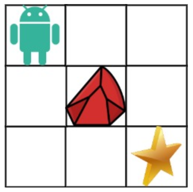

# 动态规划—不同路径和（障碍物）

[leetcode不同路径和（障碍物）](https://leetcode.cn/problems/unique-paths-ii/description/?envType=study-plan-v2&envId=dynamic-programming)

## 问题分析

一个机器人位于一个 `m x n` 网格的左上角 （起始点在下图中标记为 “Start” ）。

机器人每次只能向下或者向右移动一步。机器人试图达到网格的右下角（在下图中标记为 “Finish”）。

现在考虑网格中有障碍物。那么从左上角到右下角将会有多少条不同的路径？

网格中的障碍物和空位置分别用 `1` 和 `0` 来表示。

