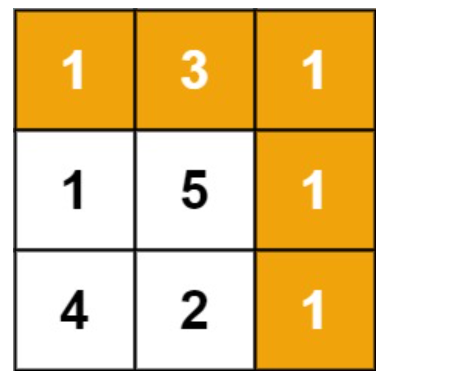

# 动态规划—最小路径和

## 问题分析

给定一个包含非负整数的 `m x n` 网格  `grid` ，请找出一条从左上角到右下角的路径，使得路径上的数字总和为最小。

设 `P(i, j)` 为到达 `(i, j)` 的最小路径和

在第一行的时候，即 `i = 0` ，此时只能往右移动，所以第一行上格子的最小路径和为 $\sum^j_{k = 1} r_{1k}$

在第一列的时候，即 `j = 0` ，此时只能往下移动，所以第一列上格子的最小路径和为 $\sum^i_{k=1}r_{k1}$ 

其余格子的最小路径和为到达上方格子和左边格子的最小路径和中的最小者，加上这个格子的路径权重

## 动态规划解法

设状态为 `P(i, j)` 即到达 `(i, j)` 的最小路径和

状态转移方程为

$$
P(i, j) = \min(P(i-1, j), P(i, j-1)) + grid(i, j)
$$
